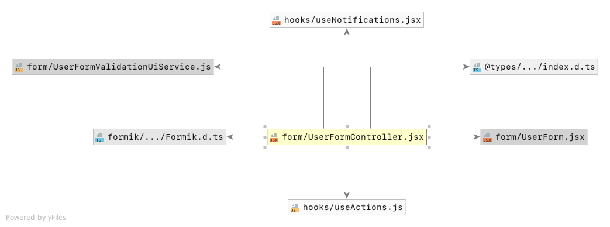

theme: Work, 3
slidenumbers: true
slidecount: true
header: #ffffff, SF Pro Display Bold
text: #ffffff, SF Pro Display Regular
text-emphasis: #ffffff, SF Pro Display Italic
code: SF Mono
footer: React Meetup August 2019 | Form validation with Formik and Folktale | Christian Wlatschiha

[.slidenumbers: false]
# [fit] Form validation<br>with<br>Formik and Folktale

---

# Agenda

1. Formik
1. Folktale
1. module folktale/validation
1. Example

---

# Formik

---

Handles the three following tasks for you:

1. Getting values in and out of form state
1. Validation and error messages
1. Handling form submission

---

## Formik

```javascript
import { Formik } from 'formik';
import { LoginForm } from './LoginForm'

export function Login() {
  return (
    <Formik
      component={LoginForm}
      initialValues={{ userName: '', password: '' }}
      onSubmit={handleSubmit}
    />
  )
}
```

---

## Form and Fields

```javascript
import { Field, Form } from 'formik';

export function LoginForm() {
  return (
    <Form>
      <Field
        type="text"
        name="userName"
        placeholder="Enter user name"
      />
    </Form>
  )
}
```

---

## From and Fields

```javascript
import { Field, Form } from 'formik';
import { PasswordInput } from './PasswordInput';

export function LoginForm() {
  return (
    <Form>
      <Field
        name="password"
        component={PasswordInput}
      />
    </Form>
  )
}
```

---

## Form Submission

```javascript
function handleSubmit(formValues, formikActions) {
  // ...

  formikActions.setSubmitting(false)
}
```

---

## Validation

```javascript
function validateForm(formValues) {
  //...

  return {
    userName: "Name can't be empty.",
    password: "Password can't be empty.",  
  }
}

<Formik validate={validateForm} />
```

---

# Folktale


---

## Data Structures

- maybe
- result
- validation

---

## Module folktale/validation

- Success(value)
- Failure(error)
- Combining validations with `collect()`
- Transforming values with `map()`, `mapFailure()`
- Reacting to results with `matchWith()`

---

# Example

---

## Libraries and Tools

- ramda
- material-ui
- formik-material-ui
- notistack
- axios
- Mockoon

---

#### Structure



---

[.slidenumbers: false]
[.footer:]
# Thank you!
